## CONTENT

> 1. Read shapefiles into R...
> 2. ...and plot some meaningful data.
> 3. Plot a map on a streetmap (ggplot + ggmap)
> 4. Remove the background street map. 
> 5. googleVis


--- 

## 1. Read shapefiles into R...


#### GET READY
                    
&nbsp;
&nbsp;
               
                          

```r
wd <- "/Users/martinez/Dropbox/R"

setwd(paste(wd, "/R_maps_workshop_slidify", sep = ""))

# Download the source from http://www.stats.ox.ac.uk/pub/RWin/bin/macosx/mavericks/contrib/3.1/
# install.packages("packages/rgdal_0.8-16.tgz", repos = NULL)
# install.packages("packages/rgeos_0.3-4.tgz", repos = NULL)
library(rgeos)
library(rgdal)

library(sp)
library(maptools)
```

--- 
## 1. Read shapefiles into R...
#### POINT SHAPEFILES: the parks
&nbsp;
           
> Load a Shapefile into R  (downladed from [madrid.org](http://www.madrid.org
/nomecalles/DescargaBDTCorte.icm)) 


```r
# get info
getinfo.shape("Shapefiles/MAD_CM_parques_jardines/parques.shp")
```

```
## Shapefile type: Point, (1), # of Shapes: 93
```

```r
# set projection
ED50<-CRS(paste("+proj=utm +zone=30 +ellps=intl +units=m +no_defs"))
# http://cicero.azavea.com/docs/epsg_codes.html equal to 'ED50(ED77) 
# / UTM zone 38N' but Marid is in the UTM zone 30

# read the shapefile
parquesMadrid <- readShapePoints("Shapefiles/MAD_CM_parques_jardines/parques.shp", proj4string = ED50)
```

--- 
## 1. Read shapefiles into R...
##### Shapefiles structure
      
      

```r
str(parquesMadrid, max.level = 2)
```

```
## Formal class 'SpatialPointsDataFrame' [package "sp"] with 5 slots
##   ..@ data       :'data.frame':	93 obs. of  9 variables:
##   .. ..- attr(*, "data_types")= chr [1:9] "N" "C" "C" "C" ...
##   ..@ coords.nrs : num(0) 
##   ..@ coords     : num [1:93, 1:2] 474496 468752 446390 446099 445527 ...
##   .. ..- attr(*, "dimnames")=List of 2
##   ..@ bbox       : num [1:2, 1:2] 401341 4432124 474496 4502774
##   .. ..- attr(*, "dimnames")=List of 2
##   ..@ proj4string:Formal class 'CRS' [package "sp"] with 1 slot
```

```r
parquesMadrid@bbox
```

```
##               min     max
## coords.x1  401341  474496
## coords.x2 4432124 4502774
```

--- 
## 1. Read shapefiles into R...
##### Shapefiles structure
      

```r
head(parquesMadrid@data)
```

```
##   CODIGO2 CMUN            MUNICIPIO
## 0       1  005 Alcal\xe1 de Henares
## 1       2  005 Alcal\xe1 de Henares
## 2       3  006           Alcobendas
## 3       4  006           Alcobendas
## 4       5  006           Alcobendas
## 5       6  007          Alcorc\xf3n
##                                   ETIQUETA
## 0 Real Jard\xedn Bot\xe1nico Juan Carlos I
## 1            Parque Municipal O\xb4Donnell
## 2                     Jard\xedn de la Vega
## 3                    Parque de Catalu\xf1a
## 4                      Parque de Andalucia
## 5               Parque Ciudad de Mayar\xed
##                                                           BUSCA
## 0 Real Jard\xedn Bot\xe1nico Juan Carlos I (Parques y Jardines)
## 1            Parque Municipal O\xb4Donnell (Parques y Jardines)
## 2                     Jard\xedn de la Vega (Parques y Jardines)
## 3                    Parque de Catalu\xf1a (Parques y Jardines)
## 4                      Parque de Andalucia (Parques y Jardines)
## 5               Parque Ciudad de Mayar\xed (Parques y Jardines)
##                                                  DIRECCION  UTM_X   UTM_Y
## 0                            Crta. Nacional II, km. 33,800 474496 4486278
## 1                            Calle V\xeda Complutense, s/n 468752 4481807
## 2 Avda. Ol\xedmpica, s/n (N-I, salida 16) c/v Avda. Ermita 446390 4487596
## 3                        Calle Marqu\xe9s de Valdavia,  23 446099 4488225
## 4             Avda. Valdelaparra, c/v Avda. Pintor Murillo 445527 4488011
## 5                                         Calle Viena, s/n 428843 4467353
##                                                                              INFOR
## 0        Real Jard\xedn Bot\xe1nico Juan Carlos I<br>Crta. Nacional II, km. 33,800
## 1                   Parque Municipal O\xb4Donnell<br>Calle V\xeda Complutense, s/n
## 2 Jard\xedn de la Vega<br>Avda. Ol\xedmpica, s/n (N-I, salida 16) c/v Avda. Ermita
## 3                       Parque de Catalu\xf1a<br>Calle Marqu\xe9s de Valdavia,  23
## 4              Parque de Andalucia<br>Avda. Valdelaparra, c/v Avda. Pintor Murillo
## 5                                   Parque Ciudad de Mayar\xed<br>Calle Viena, s/n
```


--- 
## 1. Read shapefiles into R...
##### Simple plot


```r
# which objtect plot, and by which variable set the color.
plot(parquesMadrid, col = parquesMadrid$MUNICIPIO)
```

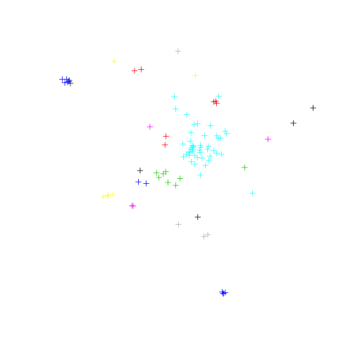 

--- 
## 1. Read shapefiles into R...
##### Simple plot


```r
# plot a subset
parquesMadrid <- parquesMadrid[parquesMadrid$MUNICIPIO == "Madrid", ]
plot(parquesMadrid, col = parquesMadrid$MUNICIPIO)
```

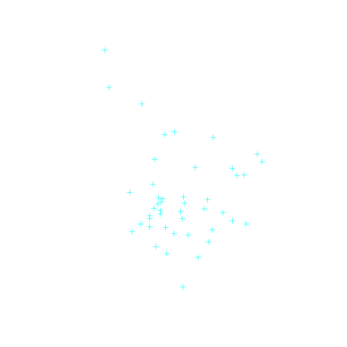 

--- 
## 1. Read shapefiles into R...
##### Simple plot


```r
# add format attributes
plot(parquesMadrid, pch = 20, cex = 2, col = "springgreen3")
```

 

--- 
## 1. Read shapefiles into R...
#### POLYGON SHAPEFILES: the neighborhoods
&nbsp;
&nbsp;


```r
getinfo.shape("Shapefiles/MAD_barrios_madrid/barrios_madrid.shp")
```

```
## Shapefile type: Polygon, (5), # of Shapes: 128
```

```r
barriosMadrid <- readShapePoly("Shapefiles/MAD_barrios_madrid/barrios_madrid.shp", proj4string = ED50)
class(barriosMadrid)
```

```
## [1] "SpatialPolygonsDataFrame"
## attr(,"package")
## [1] "sp"
```

--- 
## 1. Read shapefiles into R...
#### POLYGON SHAPEFILES: the neighborhoods

```r
str(barriosMadrid, max.level = 2)
```

```
## Formal class 'SpatialPolygonsDataFrame' [package "sp"] with 5 slots
##   ..@ data       :'data.frame':	128 obs. of  3 variables:
##   .. ..- attr(*, "data_types")= chr [1:3] "N" "C" "C"
##   ..@ polygons   :List of 128
##   .. .. [list output truncated]
##   ..@ plotOrder  : int [1:128] 44 112 114 51 125 52 106 54 127 120 ...
##   ..@ bbox       : num [1:2, 1:2] 424864 4462774 456134 4499579
##   .. ..- attr(*, "dimnames")=List of 2
##   ..@ proj4string:Formal class 'CRS' [package "sp"] with 1 slot
```

```r
barriosMadrid@bbox
```

```
##         min       max
## x  424864.2  456133.8
## y 4462773.5 4499578.9
```

```r
head(barriosMadrid@data)
```

```
##   CODBDT GEOCODIGO          DESBDT
## 0 722505    079011     011 Palacio
## 1 722506    079012 012 Embajadores
## 2 722507    079013      013 Cortes
## 3 722508    079014    014 Justicia
## 4 722509    079015 015 Universidad
## 5 722510    079016         016 Sol
```

--- 
## 1. Read shapefiles into R...
#### POLYGON SHAPEFILES: the neighborhoods

```r
plot(barriosMadrid)
plot(parquesMadrid, pch = 20, cex = 2, col = "springgreen3", add = TRUE)
```

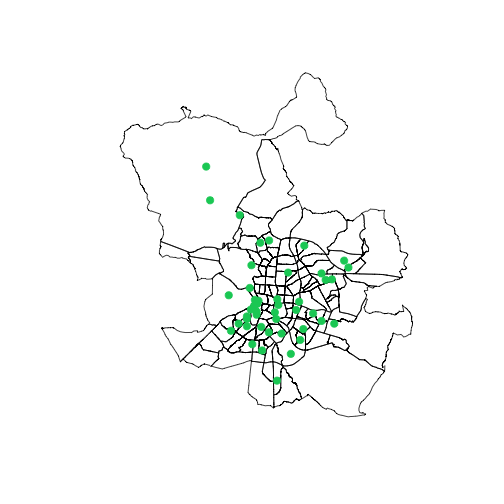 

--- 
## 2. ... and plot some meaningful data
&nbsp;&nbsp;
                   
Merge the meaningful data (e.g. neigborhoods density) with the SpatialPolygonDataFrame @data slot.
      
&nbsp; 
         
1. read the neigborhoods density.
2. get ready to merge both data frames 
3. merge them
4. and plot!

--- 
## 2. ... and plot some meaningful data

#### Read the neigborhoods density. 
downladed from [munimadrid](http://www-2.munimadrid.es/CSE6/control/seleccionDatos?numSerie=14010100010)
&nbsp;

```r
denMad <- read.csv("Data/denBarriosMad.csv", sep = ";", stringsAsFactors = FALSE)
colnames(denMad) <- c("Barrio", "Densidad")
```

--- 
## 2. ... and plot some meaningful data

#### Get ready both data frames. 

```r
head(denMad)
```

```
##                   Barrio Densidad
## 1 TOTAL CIUDAD DE MADRID       53
## 2             01. CENTRO      265
## 3           01.1 Palacio      155
## 4       01.2 Embajadores      460
## 5            01.3 Cortes      184
## 6          01.4 Justicia      229
```

```r
head(barriosMadrid@data)
```

```
##   CODBDT GEOCODIGO          DESBDT
## 0 722505    079011     011 Palacio
## 1 722506    079012 012 Embajadores
## 2 722507    079013      013 Cortes
## 3 722508    079014    014 Justicia
## 4 722509    079015 015 Universidad
## 5 722510    079016         016 Sol
```


--- 
## 2. ... and plot some meaningful data

#### Get ready both data frames: denMad

```r
# Get rid off the 'distritos'
# 'barrios' have the structure ##.# Barrioname 
# remove the "."

denMad <- denMad[which(grepl("[0-9]{2}\\.[0-9]", denMad$Barrio) == TRUE), ]
denMad$Barrio <- gsub(".", "", denMad$Barrio, fixed = TRUE)
head(denMad)
```

```
##            Barrio Densidad
## 3     011 Palacio      155
## 4 012 Embajadores      460
## 5      013 Cortes      184
## 6    014 Justicia      229
## 7 015 Universidad      343
## 8         016 Sol      176
```

--- 
## 2. ... and plot some meaningful data

#### Get ready both data frames: denMad

```r
# Detach neighborhood name from neighborhood code
barriosNamesCodes <- do.call(rbind, strsplit(sub(" ", "\\.", denMad$Barrio), "\\."))
head(barriosNamesCodes)
```

```
##      [,1]  [,2]         
## [1,] "011" "Palacio"    
## [2,] "012" "Embajadores"
## [3,] "013" "Cortes"     
## [4,] "014" "Justicia"   
## [5,] "015" "Universidad"
## [6,] "016" "Sol"
```

```r
denMad$Barrio <- barriosNamesCodes[ ,2]
denMad$BarrioCod <- barriosNamesCodes[ ,1]
```

--- 
## 2. ... and plot some meaningful data

#### Get ready both data frames: denMad

```r
head(denMad)
```

```
##        Barrio Densidad BarrioCod
## 3     Palacio      155       011
## 4 Embajadores      460       012
## 5      Cortes      184       013
## 6    Justicia      229       014
## 7 Universidad      343       015
## 8         Sol      176       016
```

```r
head(barriosMadrid@data)
```

```
##   CODBDT GEOCODIGO          DESBDT
## 0 722505    079011     011 Palacio
## 1 722506    079012 012 Embajadores
## 2 722507    079013      013 Cortes
## 3 722508    079014    014 Justicia
## 4 722509    079015 015 Universidad
## 5 722510    079016         016 Sol
```

--- 
## 2. ... and plot some meaningful data

#### Get ready both data frames: barriosMadrid SpatialPolygonDataFrame

```r
# Set the proper encoding
barriosMadrid$DESBDT <- iconv(barriosMadrid$DESBDT, "latin1", "UTF-8")

# Detach neighborhood name from neighborhood code
barriosNamesCodes <- strsplit(sub(" ", "\\.", barriosMadrid$DESBDT), "\\.")
barriosNamesCodes <- do.call(rbind, barriosNamesCodes)
head(barriosNamesCodes)
```

```
##      [,1]  [,2]         
## [1,] "011" "Palacio"    
## [2,] "012" "Embajadores"
## [3,] "013" "Cortes"     
## [4,] "014" "Justicia"   
## [5,] "015" "Universidad"
## [6,] "016" "Sol"
```

--- 
## 2. ... and plot some meaningful data

#### Get ready both data frames: barriosMadrid SpatialPolygonDataFrame

```r
barriosMadrid$BarrioCod <- barriosNamesCodes[ ,1]
barriosMadrid$Barrio <- barriosNamesCodes[ ,2]
head(barriosMadrid@data)
```

```
##   CODBDT GEOCODIGO          DESBDT BarrioCod      Barrio
## 0 722505    079011     011 Palacio       011     Palacio
## 1 722506    079012 012 Embajadores       012 Embajadores
## 2 722507    079013      013 Cortes       013      Cortes
## 3 722508    079014    014 Justicia       014    Justicia
## 4 722509    079015 015 Universidad       015 Universidad
## 5 722510    079016         016 Sol       016         Sol
```

--- 
## 2. ... and plot some meaningful data

#### Merge both data frames

```r
length(denMad$Barrio)
```

```
## [1] 128
```

```r
length(barriosMadrid$DESBDT)
```

```
## [1] 128
```

```r
identical(sort(barriosMadrid$BarrioCod), sort(denMad$BarrioCod))
```

```
## [1] TRUE
```

```r
barriosMadrid@data <- merge(barriosMadrid@data, denMad[ ,c(2,3)])
```

--- 
## 2. ... and plot some meaningful data

#### Merge both data frames

```r
head(barriosMadrid@data)
```

```
##   BarrioCod CODBDT GEOCODIGO          DESBDT      Barrio Densidad
## 1       011 722505    079011     011 Palacio     Palacio      155
## 2       012 722506    079012 012 Embajadores Embajadores      460
## 3       013 722507    079013      013 Cortes      Cortes      184
## 4       014 722508    079014    014 Justicia    Justicia      229
## 5       015 722509    079015 015 Universidad Universidad      343
## 6       016 722510    079016         016 Sol         Sol      176
```

--- 
## 2. ... and plot some meaningful data

#### and plot!

```r
plot(barriosMadrid, col = barriosMadrid$Densidad)
```

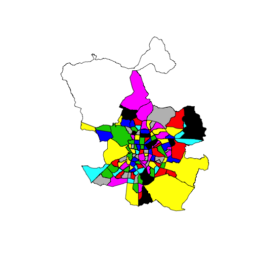 

--- 
## 2. ... and plot some meaningful data

#### and plot!

```r
# Plot with SP library using custom colors
library(RColorBrewer)
colors <- colorRampPalette(brewer.pal(9, "YlGnBu"))(16)
spplot(barriosMadrid, "Densidad", col.regions = colors)
```

 

--- 
## 2. ... and plot some meaningful data

#### and plot! Customized colors using the `plot` function

```r
# Cut the variable into breaks and assign a color to every interval.
cut <- cut(barriosMadrid$Densidad,breaks=c(0,25,50,75,100,150,200,250,300,350,500))
barriosMadrid$cut <- cut
colors <- colorRampPalette(brewer.pal(9, "YlGnBu"))(10)
cutColors <- cut(barriosMadrid$Densidad,breaks=c(0,25,50,75,100,150,200,250,300,350,500), labels = colors)
barriosMadrid$colors <- cutColors

head(barriosMadrid@data)
```

```
##   BarrioCod CODBDT GEOCODIGO          DESBDT      Barrio Densidad
## 1       011 722505    079011     011 Palacio     Palacio      155
## 2       012 722506    079012 012 Embajadores Embajadores      460
## 3       013 722507    079013      013 Cortes      Cortes      184
## 4       014 722508    079014    014 Justicia    Justicia      229
## 5       015 722509    079015 015 Universidad Universidad      343
## 6       016 722510    079016         016 Sol         Sol      176
##         cut  colors
## 1 (150,200] #30A5C2
## 2 (350,500] #081D58
## 3 (150,200] #30A5C2
## 4 (200,250] #1E80B8
## 5 (300,350] #21318D
## 6 (150,200] #30A5C2
```

--- 
## 2. ... and plot some meaningful data

#### and plot! Customized colors using the `plot` function

```r
plot(barriosMadrid, col = as.character(barriosMadrid@data$colors))
legend("bottomleft", cex = .7, legend = levels(barriosMadrid$cut), fill = colors, title = "Population density Madrid (2013)")
```

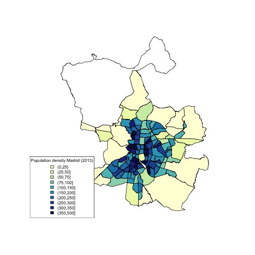 

--- 
## 2. ... and plot some meaningful data

#### and plot! Add neighborhoods labels

```r
# calculate the polygons centers
# the coordinates function gives the centers of an SpatialPolygonDataFrame
cents <- coordinates(barriosMadrid)
head(cents)
```

```
##       [,1]    [,2]
## 0 439528.9 4474317
## 1 440497.1 4473624
## 2 440990.3 4474246
## 3 441010.5 4475220
## 4 440128.7 4475452
## 5 440335.8 4474520
```

--- 
## 2. ... and plot some meaningful data

#### and plot!

```r
#png("labels.png", width = 2500, height = 2100)
plot(barriosMadrid, col = as.character(barriosMadrid@data$colors))
plot(parquesMadrid, pch = 20, cex = 4, col = "springgreen3", add = TRUE)
pointLabel(cents[ ,1], cents[ ,2], labels=barriosMadrid$Barrio)
legend("bottomleft", cex = .9, legend = levels(barriosMadrid$cut), fill = colors, title = "Population density Madrid (2013)")
```

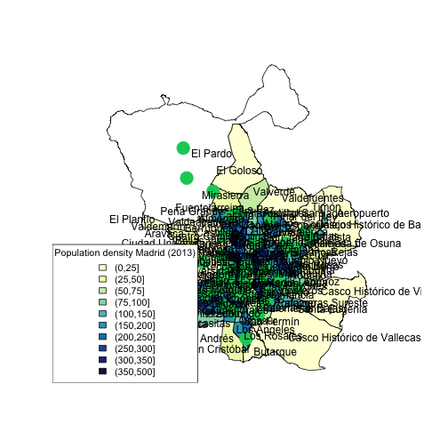 

```r
#dev.off()
```

--- 
## 2. ... and plot some meaningful data

#### and plot!: density as points

```r
# maptools function
# plot as many dots as people living in every polygon
dots <- dotsInPolys(barriosMadrid, barriosMadrid$Densidad)
plot(dots, pch = 16, cex = .1, col = "violetred3")
```

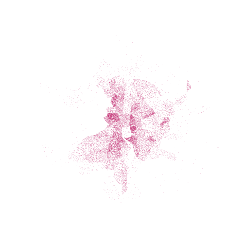 

--- 
## 2. ... and plot some meaningful data

#### and plot!: density as points over the neighborhood and include the parks

```r
plot(barriosMadrid, col = "grey90")
plot(dots, pch = 16, cex = .1, col = "violetred3", add = TRUE)
plot(parquesMadrid, pch = 20, cex = 1, col = "springgreen3", add = TRUE)
```

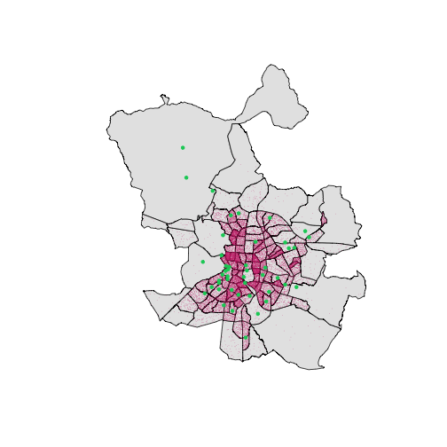 

--- 
## 2. ... and plot some meaningful data
#### and plot!: include the metro lines

```r
metroLines <- readShapeLines("Shapefiles/MAD_lineas_metro/lineas.shp", proj4string = ED50)

plot(barriosMadrid, col = "grey90")
plot(dots, pch = 16, cex = .1, col = "violetred3", add = TRUE)
plot(parquesMadrid, pch = 20, cex = 1, col = "springgreen3", add = TRUE)
plot(metroLines, col = "turquoise3", lwd = 2, add = TRUE)
```

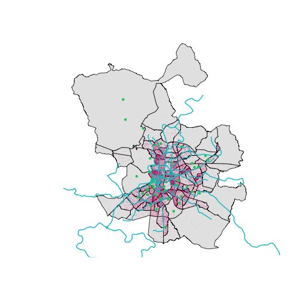 

--- 

## 3. Plot a map on a street map 

#### ggplot2 + ggmap 
             
&nbsp;
            
The **rgdal** and **rgeos** libraries are required. 
              
&nbsp;
&nbsp;

1. Change the coordinate system, as we have UTM in our objects and ggplot works on **long, lat** coordinates.  
2. Create a dataframe from the Spatial**DataFrame data slot, containing the long and lat variables, as ggplot plots do not plot Spatial objects but dataframes.
3. and plot! (ggplot2 + ggmap)
           


--- 

## 3. Plot a map on a street map 
#### Change the coordinate system


```r
str(barriosMadrid, max.level = 2)
```

```
## Formal class 'SpatialPolygonsDataFrame' [package "sp"] with 5 slots
##   ..@ data       :'data.frame':	128 obs. of  8 variables:
##   ..@ polygons   :List of 128
##   .. .. [list output truncated]
##   ..@ plotOrder  : int [1:128] 44 112 114 51 125 52 106 54 127 120 ...
##   ..@ bbox       : num [1:2, 1:2] 424864 4462774 456134 4499579
##   .. ..- attr(*, "dimnames")=List of 2
##   ..@ proj4string:Formal class 'CRS' [package "sp"] with 1 slot
```

```r
barriosMadrid@proj4string
```

```
## CRS arguments:
##  +proj=utm +zone=30 +ellps=intl +units=m +no_defs
```

```r
# Transform the coordinates to lon lat
barriosLongLat <- spTransform(barriosMadrid, CRS("+proj=longlat"))  
parquesLongLat <- spTransform(parquesMadrid, CRS("+proj=longlat"))
metroLongLat <- spTransform(metroLines, CRS("+proj=longlat"))
```

--- 

## 3. Plot a map on a street map 
#### Create a dataframe from the Spatial**DataFrame data slot. 
#### Points DataFrame to ggplot


```r
library(ggplot2)

# Points DataFrame to ggplot
head(coordinates(parquesLongLat))
```

```
##    coords.x1 coords.x2
## 24 -3.615614  40.40292
## 25 -3.698585  40.48262
## 26 -3.709616  40.48038
## 27 -3.598206  40.45714
## 28 -3.681976  40.39302
## 29 -3.654543  40.39753
```

```r
long <- coordinates(parquesLongLat)[, 1]  
lat <- coordinates(parquesLongLat)[, 2]
```

--- 

## 3. Plot a map on a street map 
#### Create a dataframe from the Spatial**DataFrame data slot. 
#### Points DataFrame to ggplot


```r
dataParques <- cbind(parquesLongLat@data, long, lat)
head(dataParques)
```

```
##    CODIGO2 CMUN MUNICIPIO                                      ETIQUETA
## 24      25  079    Madrid Parque Forestal de Valdebernardo (Vicálvaro)
## 25      26  079    Madrid                                  Parque Norte
## 26      27  079    Madrid                          Parque de la Vaguada
## 27      28  079    Madrid         Parque El Capricho (Alameda de Osuna)
## 28      29  079    Madrid        Parque Enrique Tierno Galván (Madrid)
## 29      30  079    Madrid                    Parque Cerro del Tío Pío
##                                                                 BUSCA
## 24 Parque Forestal de Valdebernardo (Vicálvaro) (Parques y Jardines)
## 25                                  Parque Norte (Parques y Jardines)
## 26                          Parque de la Vaguada (Parques y Jardines)
## 27         Parque El Capricho (Alameda de Osuna) (Parques y Jardines)
## 28        Parque Enrique Tierno Galván (Madrid) (Parques y Jardines)
## 29                    Parque Cerro del Tío Pío (Parques y Jardines)
##                                              DIRECCION  UTM_X   UTM_Y
## 24                                Avda. Democracia, 29 447759 4472738
## 25                       Avda. Monforte de Lemos , s/n 440788 4481637
## 26                         Avda. Monforte de Lemos, 42 439851 4481396
## 27                              Avda. de Logroño, s/n 449277 4478747
## 28                          Avda. del Planetario , s/n 442119 4471681
## 29 Barrio de Vallecas cerca de la Avda. de la Albufera 444451 4472164
##                                                                                INFOR
## 24             Parque Forestal de Valdebernardo (Vicálvaro)<br>Avda. Democracia, 29
## 25                                     Parque Norte<br>Avda. Monforte de Lemos , s/n
## 26                               Parque de la Vaguada<br>Avda. Monforte de Lemos, 42
## 27                   Parque El Capricho (Alameda de Osuna)<br>Avda. de Logroño, s/n
## 28              Parque Enrique Tierno Galván (Madrid)<br>Avda. del Planetario , s/n
## 29 Parque Cerro del Tío Pío<br>Barrio de Vallecas cerca de la Avda. de la Albufera
##         long      lat
## 24 -3.615614 40.40292
## 25 -3.698585 40.48262
## 26 -3.709616 40.48038
## 27 -3.598206 40.45714
## 28 -3.681976 40.39302
## 29 -3.654543 40.39753
```

--- 

## 3. Plot a map on a street map 
#### Create a dataframe from the Spatial**DataFrame data slot. 
#### Points DataFrame to ggplot


```r
ggplot(dataParques, aes(long, lat)) +
geom_point(colour = "springgreen3", size = 4)
```

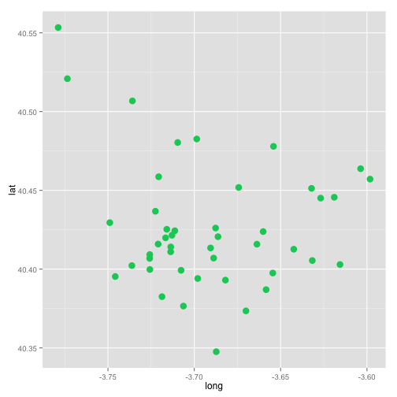 

--- 

## 3. Plot a map on a street map 
#### Create a dataframe from the Spatial**DataFrame data slot. 
#### Polygons DataFrame to ggplot


```r
# The coordinates are the centers
head(coordinates(barriosLongLat))
```

```
##        [,1]     [,2]
## 0 -3.712742 40.41658
## 1 -3.701266 40.41042
## 2 -3.695512 40.41605
## 3 -3.695364 40.42483
## 4 -3.705780 40.42685
## 5 -3.703251 40.41848
```

```r
barriosLongLat@data$id <- rownames(barriosLongLat@data)
head(barriosLongLat@data)
```

```
##   BarrioCod CODBDT GEOCODIGO          DESBDT      Barrio Densidad
## 1       011 722505    079011     011 Palacio     Palacio      155
## 2       012 722506    079012 012 Embajadores Embajadores      460
## 3       013 722507    079013      013 Cortes      Cortes      184
## 4       014 722508    079014    014 Justicia    Justicia      229
## 5       015 722509    079015 015 Universidad Universidad      343
## 6       016 722510    079016         016 Sol         Sol      176
##         cut  colors id
## 1 (150,200] #30A5C2  1
## 2 (350,500] #081D58  2
## 3 (150,200] #30A5C2  3
## 4 (200,250] #1E80B8  4
## 5 (300,350] #21318D  5
## 6 (150,200] #30A5C2  6
```

--- 

## 3. Plot a map on a street map 
#### Create a dataframe from the Spatial**DataFrame data slot. 
#### Polygons DataFrame to ggplot


```r
# magic
dataBarrios <- fortify(barriosLongLat, region="id") 
class(dataBarrios)
```

```
## [1] "data.frame"
```

```r
head(dataBarrios)
```

```
##        long      lat order  hole piece group id
## 1 -3.708078 40.42364     1 FALSE     1   1.1  1
## 2 -3.707932 40.42355     2 FALSE     1   1.1  1
## 3 -3.707775 40.42345     3 FALSE     1   1.1  1
## 4 -3.707687 40.42339     4 FALSE     1   1.1  1
## 5 -3.707599 40.42333     5 FALSE     1   1.1  1
## 6 -3.707521 40.42328     6 FALSE     1   1.1  1
```

--- 

## 3. Plot a map on a street map 
#### Create a dataframe from the Spatial**DataFrame data slot. 
#### Polygons DataFrame to ggplot


```r
dataBarrios <- merge(dataBarrios, barriosLongLat@data)
head(dataBarrios)
```

```
##   id      long      lat order  hole piece group BarrioCod CODBDT GEOCODIGO
## 1  1 -3.708078 40.42364     1 FALSE     1   1.1       011 722505    079011
## 2  1 -3.707932 40.42355     2 FALSE     1   1.1       011 722505    079011
## 3  1 -3.707775 40.42345     3 FALSE     1   1.1       011 722505    079011
## 4  1 -3.707687 40.42339     4 FALSE     1   1.1       011 722505    079011
## 5  1 -3.707599 40.42333     5 FALSE     1   1.1       011 722505    079011
## 6  1 -3.707521 40.42328     6 FALSE     1   1.1       011 722505    079011
##        DESBDT  Barrio Densidad       cut  colors
## 1 011 Palacio Palacio      155 (150,200] #30A5C2
## 2 011 Palacio Palacio      155 (150,200] #30A5C2
## 3 011 Palacio Palacio      155 (150,200] #30A5C2
## 4 011 Palacio Palacio      155 (150,200] #30A5C2
## 5 011 Palacio Palacio      155 (150,200] #30A5C2
## 6 011 Palacio Palacio      155 (150,200] #30A5C2
```


--- 

## 3. Plot a map on a street map 
#### Create a dataframe from the Spatial**DataFrame data slot. 
#### Lines DataFrame to ggplot


```r
metroLongLat@data$id <- rownames(metroLongLat@data)
dataMetro <- fortify(metroLongLat, region="id")  # requires rgeos package
dataMetro <- merge(dataMetro, metroLongLat@data)
head(dataMetro)
```

```
##   id      long      lat order piece group ETIQUETA
## 1  0 -3.765998 40.24729     1     1   0.1       TP
## 2  0 -3.766046 40.24718     2     1   0.1       TP
## 3  0 -3.766149 40.24691     3     1   0.1       TP
## 4  0 -3.766229 40.24671     4     1   0.1       TP
## 5  0 -3.766502 40.24605     5     1   0.1       TP
## 6  0 -3.767064 40.24459     6     1   0.1       TP
```

```r
unique(dataMetro$ETIQUETA)
```

```
##  [1] TP     L9     L1     ML-1   L3     L10    ML-2   L11    L2     L12   
## [11] ML-3   L4     L6     Ramal  L5     L8     L7     Transb
## 18 Levels: L1 L10 L11 L12 L2 L3 L4 L5 L6 L7 L8 L9 ML-1 ML-2 ML-3 ... Transb
```

--- 

## 3. Plot a map on a street map 
#### Plot them! get the map

```r
library(ggmap)
MadridMap <- qmap(location = "Museo del Prado", zoom = 15, source = "google")
```

```
## Map from URL : http://maps.googleapis.com/maps/api/staticmap?center=Museo+del+Prado&zoom=15&size=640x640&scale=2&maptype=terrain&language=en-EN&sensor=false
## Information from URL : http://maps.googleapis.com/maps/api/geocode/json?address=Museo+del+Prado&sensor=false
```

```r
MadridMap
```

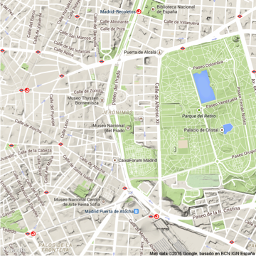 

--- 

## 3. Plot a map on a street map 
#### Plot them! get the map

```r
MadridMap <- qmap(location = barriosLongLat@bbox, zoom = 11, maptype = "terrain")  # Get the map from Google maps
```

```
## converting bounding box to center/zoom specification. (experimental)
## Map from URL : http://maps.googleapis.com/maps/api/staticmap?center=40.478877,-3.702281&zoom=11&size=640x640&scale=2&maptype=terrain&language=en-EN&sensor=false
```

```r
MadridMap
```

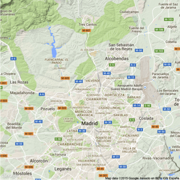 

--- 

## 3. Plot a map on a street map 
#### Plot them! get the map

```r
MadridMap + 
  geom_polygon(aes( x = long, y = lat, group = group, fill = Densidad), data = dataBarrios, alpha = 0.5, colour = "white") +
  scale_fill_gradient(low="grey90", high="black", limits=c(0,500)) +
  geom_path(aes(x = long, y = lat, group = group), data = dataMetro, colour = "turquoise3") +
	geom_point(aes(x = long, y = lat), data = dataParques,  , size = 5, alpha = 0.8, colour = "springgreen3")+
	theme(legend.position = "none")
```

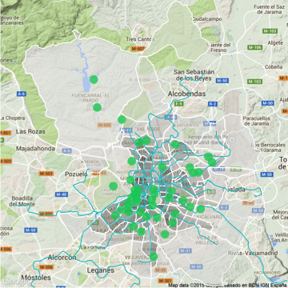 


--- 
## 4. Plot a map with ggplot without a background street map. 

```r
ggplot() + geom_polygon(aes(x=long, y=lat, group = group, fill = Densidad), data = dataBarrios) + 
	scale_fill_gradient(low="grey90", high="black", limits=c(0,500)) +
	geom_point(aes(x=long, y=lat, size = 5), data = dataParques, colour = "springgreen3") +
	geom_path(aes(x=long, y = lat, group = group), data = dataMetro, colour = "turquoise3") +
	theme(legend.position = "none", 
  	  panel.background = element_blank(),
  	  panel.grid = element_blank(),
  	  axis.ticks = element_blank(),
  	  text = element_blank())
```

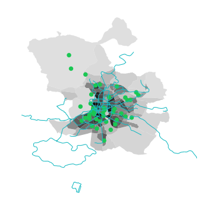 

--- 
## 5. googleVis

```r
library(googleVis)
suppressPackageStartupMessages(library(googleVis))
emigrantes <- read.csv("Data/emigrantes.csv", sep = ";")
head(emigrantes)
```

```
##     X                pais  X2008  X2009  X2010  X2011  X2012
## 1 131    PAIS DESCONOCIDO  52069  94850 134790 138972 146309
## 2 132 BAJAS POR CADUCIDAD 142315 154213 163515 139223 130421
## 3  82             AMERICA  26993  29440  29319  36618  43667
## 4  92             Ecuador   1693   3027   4292   6668  10622
## 5  29         Reino Unido   5186   5339   6249   8237   8055
## 6  17             Francia   4394   4338   5105   6130   6960
```

```r
# me quedo las que no empiezan por dos mayúsculas
emigrantes <- emigrantes[which(grepl("^[A-Z]{2}", emigrantes$pais) == FALSE), ]
head(emigrantes)
```

```
##     X           pais X2008 X2009 X2010 X2011 X2012
## 4  92        Ecuador  1693  3027  4292  6668 10622
## 5  29    Reino Unido  5186  5339  6249  8237  8055
## 6  17        Francia  4394  4338  5105  6130  6960
## 7   8       Alemania  3991  4123  4658  5904  6577
## 10 32        Rumanía  5854  5673  4875  5076  5359
## 11 94 Estados Unidos  4163  3897  3647  4891  4498
```

--- &interactive
## 5. googleVis

```r
emigrantesMap <- gvisGeoChart(emigrantes, locationvar = "pais", colorvar = "X2012", options = list(width = 600, height = 400))
print(emigrantesMap, tag = 'chart')
```

<!-- GeoChart generated in R 3.1.2 by googleVis 0.5.8 package -->
<!-- Tue Apr 14 14:26:22 2015 -->


<!-- jsHeader -->
<script type="text/javascript">
 
// jsData 
function gvisDataGeoChartID75ded5978d0 () {
var data = new google.visualization.DataTable();
var datajson =
[
 [
 "Ecuador",
10622 
],
[
 "Reino Unido",
8055 
],
[
 "Francia",
6960 
],
[
 "Alemania",
6577 
],
[
 "Rumanía",
5359 
],
[
 "Estados Unidos",
4498 
],
[
 "Colombia",
4190 
],
[
 "Marruecos",
3894 
],
[
 "Argentina",
3544 
],
[
 "Suiza",
3217 
],
[
 "Bolivia",
3128 
],
[
 "Venezuela",
3036 
],
[
 "Bélgica",
2805 
],
[
 "Perú",
2698 
],
[
 "Brasil",
2574 
],
[
 "Chile",
1965 
],
[
 "Países Bajos",
1677 
],
[
 "Italia",
1642 
],
[
 "Portugal",
1636 
],
[
 "China",
1354 
],
[
 "Bulgaria",
1265 
],
[
 "Paraguay",
1260 
],
[
 "República Dominicana",
1222 
],
[
 "Uruguay",
1127 
],
[
 "México",
1050 
],
[
 "Asia: Otros países",
975 
],
[
 "Cuba",
727 
],
[
 "Andorra",
694 
],
[
 "Polonia",
645 
],
[
 "Ucrania",
635 
],
[
 "Canadá",
628 
],
[
 "Australia",
609 
],
[
 "Suecia",
589 
],
[
 "Irlanda",
539 
],
[
 "Austria",
498 
],
[
 "Argelia",
482 
],
[
 "Noruega",
462 
],
[
 "Honduras",
392 
],
[
 "Panamá",
387 
],
[
 "Guinea Ecuatorial",
357 
],
[
 "Rusia",
355 
],
[
 "Dinamarca",
305 
],
[
 "India",
279 
],
[
 "Arabia Saudí",
268 
],
[
 "Nicaragua",
257 
],
[
 "Pakistán",
250 
],
[
 "Senegal",
243 
],
[
 "Luxemburgo",
219 
],
[
 "Finlandia",
218 
],
[
 "Lituania",
213 
],
[
 "Filipinas",
205 
],
[
 "Japón",
197 
],
[
 "República Checa",
171 
],
[
 "Nigeria",
168 
],
[
 "Turquía",
143 
],
[
 "Guatemala",
142 
],
[
 "Hungría",
140 
],
[
 "Sudáfrica",
138 
],
[
 "África: Otros países",
119 
],
[
 "El Salvador",
110 
],
[
 "Georgia",
106 
],
[
 "República Eslovaca",
100 
],
[
 "Gambia",
95 
],
[
 "Moldova",
92 
],
[
 "Corea (República de)",
92 
],
[
 "Egipto",
90 
],
[
 "Israel",
85 
],
[
 "Costa Rica",
84 
],
[
 "Mauritania",
83 
],
[
 "Indonesia",
83 
],
[
 "Tailandia",
81 
],
[
 "Serbia",
74 
],
[
 "Bangladesh",
65 
],
[
 "Grecia",
58 
],
[
 "Vietnam",
56 
],
[
 "Líbano",
50 
],
[
 "Malí",
49 
],
[
 "Nueva Zelanda",
49 
],
[
 "Ghana",
47 
],
[
 "Angola",
45 
],
[
 "Malta",
43 
],
[
 "Armenia",
39 
],
[
 "Etiopía",
39 
],
[
 "Croacia",
38 
],
[
 "Kenia",
37 
],
[
 "Túnez",
34 
],
[
 "Letonia",
32 
],
[
 "Islandia",
30 
],
[
 "Costa de Marfil",
30 
],
[
 "Guinea-Bissau",
28 
],
[
 "Cabo Verde",
26 
],
[
 "América: Otros países",
26 
],
[
 "Jordania",
24 
],
[
 "Camerún",
23 
],
[
 "Bielorrusia",
22 
],
[
 "Eslovenia",
21 
],
[
 "Chipre",
20 
],
[
 "Bosnia y Herzegovina",
19 
],
[
 "Guinea",
18 
],
[
 "Estonia",
17 
],
[
 "Siria",
17 
],
[
 "Kazajstán",
16 
],
[
 "Albania",
13 
],
[
 "Liechtenstein",
13 
],
[
 "Irán",
13 
],
[
 "Macedonia (Ex-República Yugoslava de)",
11 
],
[
 "Burkina Faso",
10 
],
[
 "Nepal",
10 
],
[
 "Congo (República del)",
9 
],
[
 "Irak",
8 
],
[
 "Congo (República Democrática del)",
7 
],
[
 "Oceanía: Otros países",
7 
],
[
 "Benín",
6 
],
[
 "Resto de Europa: Otros países",
4 
],
[
 "Sierra Leona",
4 
],
[
 "Togo",
4 
],
[
 "Liberia",
3 
],
[
 "Dominica",
0 
] 
];
data.addColumn('string','pais');
data.addColumn('number','X2012');
data.addRows(datajson);
return(data);
}
 
// jsDrawChart
function drawChartGeoChartID75ded5978d0() {
var data = gvisDataGeoChartID75ded5978d0();
var options = {};
options["width"] =    600;
options["height"] =    400;

    var chart = new google.visualization.GeoChart(
    document.getElementById('GeoChartID75ded5978d0')
    );
    chart.draw(data,options);
    

}
  
 
// jsDisplayChart
(function() {
var pkgs = window.__gvisPackages = window.__gvisPackages || [];
var callbacks = window.__gvisCallbacks = window.__gvisCallbacks || [];
var chartid = "geochart";
  
// Manually see if chartid is in pkgs (not all browsers support Array.indexOf)
var i, newPackage = true;
for (i = 0; newPackage && i < pkgs.length; i++) {
if (pkgs[i] === chartid)
newPackage = false;
}
if (newPackage)
  pkgs.push(chartid);
  
// Add the drawChart function to the global list of callbacks
callbacks.push(drawChartGeoChartID75ded5978d0);
})();
function displayChartGeoChartID75ded5978d0() {
  var pkgs = window.__gvisPackages = window.__gvisPackages || [];
  var callbacks = window.__gvisCallbacks = window.__gvisCallbacks || [];
  window.clearTimeout(window.__gvisLoad);
  // The timeout is set to 100 because otherwise the container div we are
  // targeting might not be part of the document yet
  window.__gvisLoad = setTimeout(function() {
  var pkgCount = pkgs.length;
  google.load("visualization", "1", { packages:pkgs, callback: function() {
  if (pkgCount != pkgs.length) {
  // Race condition where another setTimeout call snuck in after us; if
  // that call added a package, we must not shift its callback
  return;
}
while (callbacks.length > 0)
callbacks.shift()();
} });
}, 100);
}
 
// jsFooter
</script>
 
<!-- jsChart -->  
<script type="text/javascript" src="https://www.google.com/jsapi?callback=displayChartGeoChartID75ded5978d0"></script>
 
<!-- divChart -->
  
<div id="GeoChartID75ded5978d0" 
  style="width: 600; height: 400;">
</div>

```r
# plot(emigrantesMap)
# cat(emigrantesMap$html$chart, file="emigrantes2012.html")
```

--- 
                         
&nbsp;
&nbsp;
&nbsp;
&nbsp;
                    
                    
## R to cartoDB
[walkerke RPubs](http://rpubs.com/walkerke/r2cartodb)

